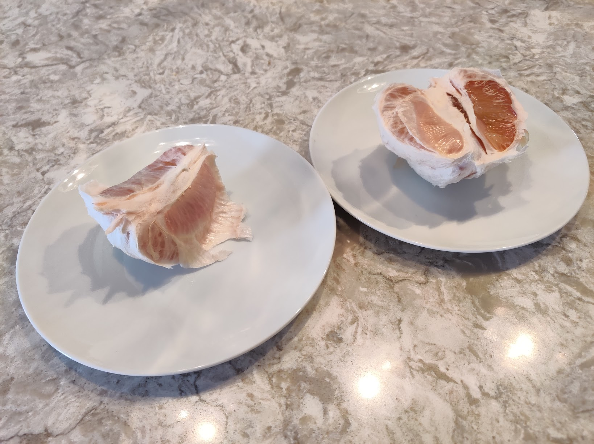
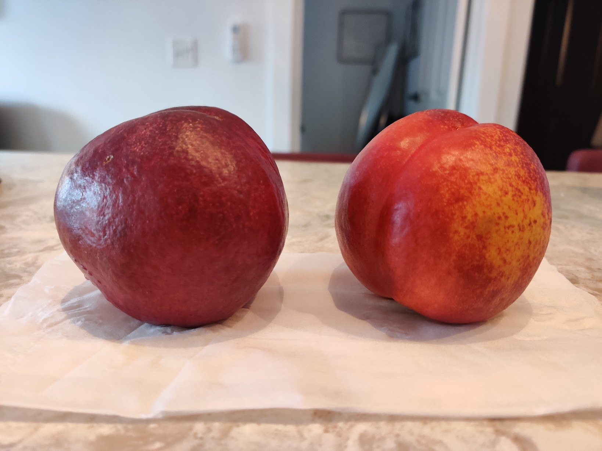
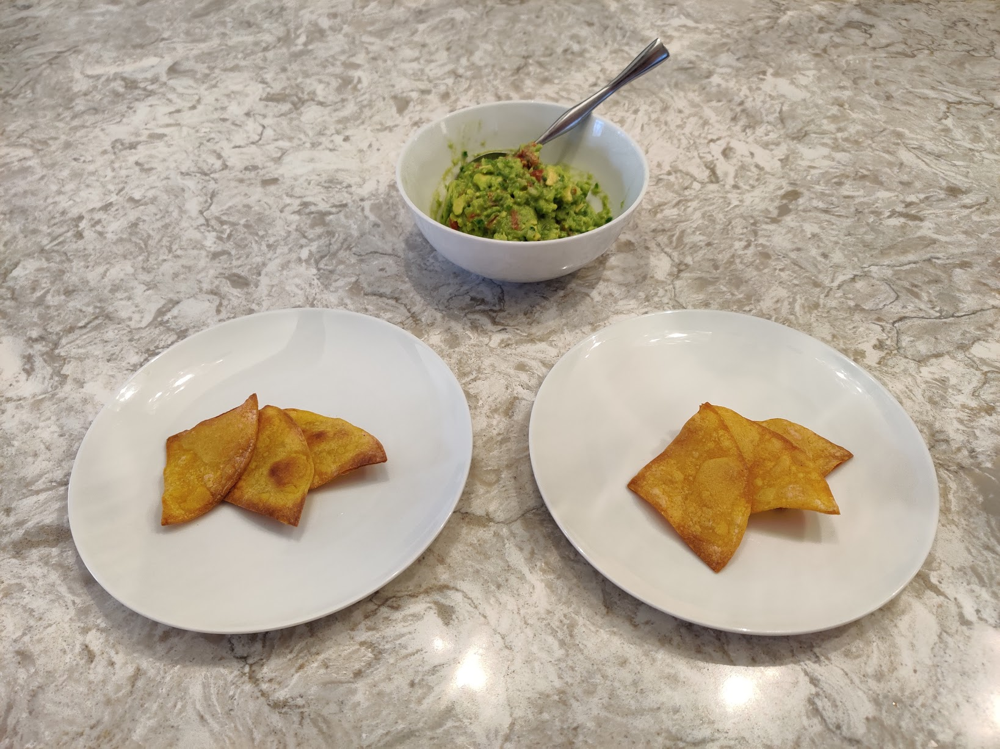
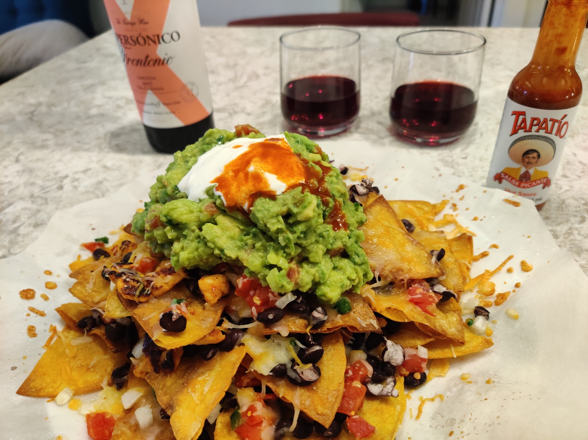

# meal-swap

A project to swap meals between a big boy and a skinny girl
for the purposes of losing and gaining weight.

## How it works

Each of participant prepares their plate / cup,
and places it in front of themselves.
Immediately before eating
they each exclaim "meal swap!",
and rotate their plates and cups to be in front
of the other.

They proceed to enjoy or dis-enjoy their partner's meal,
and complain about it on this page.

In each picture,
on the left is _Aimee'_ original meal
(the one Brian gets to eat),
and on the right is _Brian's_ original meal
(the one Aimee gets to eat).

## Swap-log!

<!-- template

#### Meal X · XX:XX PM

_Aimee's thoughts_:
TBD

_Brian's thoughts_:
TBD

-->

### 2021-01-23 Saturday

#### Meal 1 · 12:24 PM

Coffee.

_Aimee's thoughts_:
I had my first meal, typical yogurt bow and black coffee,
about four hours earlier, and this is my second meal of the day.
I am not hungry, but I'd love to have another coffee.
I feel I am drinking milk, though.
I don't think I ever liked milk in my life.

_Brian's thoughts_:
Aimee woke up this morning and ate a non-meal-swap meal!
It's not even documented!
It was just a regular meal!
Not fair!

The coffee was fine.

#### Meal 2 · 2:32 PM

Yòuzi.

Surprise find in the local grocery today.

_Aimee's thoughts_:
I am confused with the swap process that whether 
I should put in the piece of Yòuzi to Brian's mouth or mine. 
First time I learned eating with the thin skin on. Yummy!

_Brian's thoughts_:
Love these so much.
We both wanted to eat as much as we can,
so the swap was basically a nop.

#### Meal 3 · 2:42 PM

Nectarines.

_Aimee's thoughts_:
Nectarines look fresh and delicious.
Brian finally agreed on this meal-swap, and I got my nectarine! 

_Brian's thoughts_:
Aimee really wanted one of these,
so in order for her to eat them I needed to _pretend to want one_.
Then,
because she really wanted to eat one,
I ended up _having_ to eat one!
It was both reality-bending,
and ultimately I think an exploit of a loophole in the meal-swap ruleset.

#### Special Tasting! · 3:41 PM

Tortilla chips.

Chips on the left are baked in extra virgin cold pressed avocado oil,
on the right in refined avocado oil.
Both mixed with some lime juice and salt.

_Aimee's thoughts_:
I like the left chips better because they are more crispy.
I can't tell the differences from oils.

_Brian's thoughts_:
Though the oils taste different,
the chips don't.
Sad result.

#### Meal 4 · 4:37 PM

Nachos, with garnacha.

Nobody can stop us from making killer nachos,
nor from drinking a delicious garnacha.

_Aimee's thoughts_:
This is the best nachos! Everything is perfect, and
each step is well processed: the guacamole, beans, chicks...
We can't stop thinking of inviting friends and neighbors to
our nachos pub!
We usually exchange chips as each preference,
chips with more beans and chicks are for Brian,
chips with more guacamole are for Aimee.
Now I am confused again: when I get a chip full of
beans and plan to deliver to Brian, should I swap back to myself?

_Brian's thoughts_:
So good.
We both wanted to scarf these down,
and again with the single plate,
it was not clear how to conduct the meal-swap.
We ended up inventing the "chip-swap",
a type of meal swap where we each load up our favorite chip
and deliver it to the other.

The garnacha is the most uninteresting wine of this variety I've had in recent memory.

#### Meal 5 · 9:00 PM

Passionflower tea.

_Aimee's thoughts_:
Both of us wanted tea and I prepared passionflower tea again. 
This time, I think I was preparing a real Brian's type of tea (with soy milk) for Brian, 
and the other plain tea for myself. 
Brian stared at the milk cup with greedy eyes. 
After the meal swap, he had a sip of my tea (original his tea).
At the end, he couldn't finish the plain tea that is swapped with me.
I finished mine, even I still think it's a milk tea, or rather, milk.

_Brian's thoughts_:
TBD

### 2021-01-22 Friday

#### Meal 1 · 10:56 AM

Yogurt, Oats, Coffee.

_Aimee's thoughts_: 
I'm hungry, and I want more yogurt and honey rather than banana chips or walnuts.
I think I'm drinking milk but not coffee.

_Brian's thoughts_:
I'm not hungry in the morning.

#### Meal 2 · 12:58 PM

Coffee (French press).

_Aimee's thoughts_:
I am eyeing Brian's coffee, that classic black coffee.

_Brian's thoughts_:
Aimee's coffee with a little bit of soy milk is delicious.
Mine is drinkable.
We don't typically use a French press.

#### Meal 3 · 4:01 PM

Tofu and broccoli,
fried in olive oil,
paired with CBD sparkling water that we received as a housewarming gift.

_Aimee's thoughts_:
I am not a big fan of fried food, but I do like fried tofu.
The tree(broccoli) tastes great with a bit of fried flour on it.
I want more vegetables and I feed those to Brian, but I couldn't eat more tofu as his appetite.

_Brian's thoughts_:
We struggled to figure out how to swap a shared plate.
In the end we picked the bites we wanted,
and traded them.
I did not receive a satisfying quantity of tofu.

The CBD water was as dumb as expected &mdash;
bad taste, no chill.
I do in general though appreciate Untitled Art,
the producer,
who commission lots of interesting untraditional beers in the midwest.

#### Meal 4 · 6:17 PM

French wine of some kind.

We went on a walk to get groceries,
but an intoxicated man without a mask was blocking
the grocery store entrance and harassing people.

So we kept walking and found an excellent wine store.

_Aimee's thoughts_:
This might be the oldest wine I've ever had. It tastes not-waking-up yet at first,
and still very tender in last glass. We've been confusing about
"I want more, should I pour another in my glass or his/her glass".

_Brian's thoughts_:
Liked it!
I like most dry red wines lately,
particularly if they've got a bit of spicy kick to them.
The flavor's not all that exciting,
but it's not boring.

#### Meal 5 · 8:53 PM

Baked brussel's sprouts and goop-covered chicken,
paired with the same wine from the afternoon.

Our plan was to make nachos tonight,
but as previously mentioned,
we were thwarted at the grocery store and bought wine instead of nacho parts.

_Aimee's thoughts_: 
We chose lazy cooking for this meal -- throw everything in the oven. 
Brian invented a new sauce for baking meat, it didn't turn out as he expected, though.
I think chicken looks good when I cut it and tasted tender too. 
A bit of maple syrup on Brussels's sprouts helped the coloring. 
Brian love it! He loves syrup anyway.
Now I have to eat a big piece of chicken and too many vegetables in my meal.
I think Brian is still hungry.

_Brian's thoughts_:
I tried to invent a batter for the chicken,
of peanut oil, flour, and BBQ rub.
It did not crisp up, just glooped.
The brussel's sprouts Aimee prepared were fantastic though.

#### Meal 6 · 9:38 PM

Passionflower tea.

_Aimee's thoughts_:
Both of us wanted tea and I prepared passionflower tea again. This time, I think I was preparing a real Brian's type of tea (with soy milk) for Brian, and the other plain tea for myself, and we swapped them

_Brian's thoughts_:
The best part about this drink
was Aimee complaining about the _drop_ of soy milk ruining her (previously "my") tea.
She prepared these,
and I _know_ she put much less soy milk in my (later "her") tea than she usually does for me.
Not fair!

My tea tasted ok.

Would have liked some soy milk in it.
