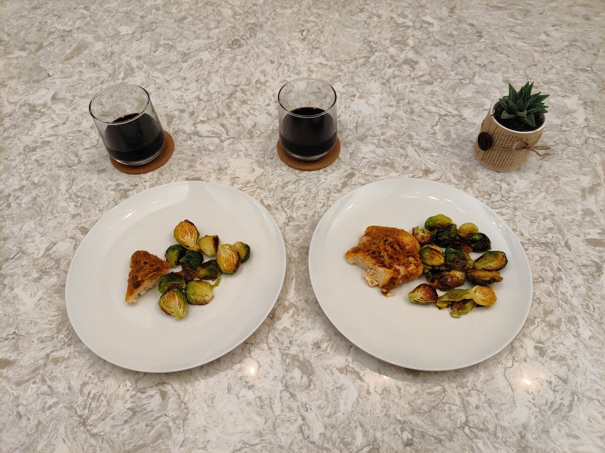

# meal-swap

A project to swap meals between a big boy and a skinny girl
for the purposes of losing and gaining weight.

## How it works

Each of participant prepares their plate / cup,
and places it in front of themselves.
Immediately before eating
they each exclaim "meal swap!",
and rotate their plates and cups to be in front
of the other.

They proceed to enjoy or dis-enjoy their partner's meal,
and complain about it on this page.

In each picture,
on the left is _Aimee'_ original meal
(the one Brian gets to eat),
and on the right is _Brian's_ original meal
(the one Aimee gets to eat).

## Swap-log!

### 2021-01-22 Friday

#### Meal 1 · 10:56 AM

Yogurt, Oats, Coffee.

_Aimee's thoughts_: 
I'm hungry, and I want more yogurt and honey rather than banana chips or walnuts.
I think I'm drinking milk but not coffee.

_Brian's thoughts_:
I'm not hungry in the morning.

#### Meal 2 · 12:58 PM

Coffee (French press).

_Aimee's thoughts_:
I am eyeing Brian's coffee, that classic black coffee.

_Brian's thoughts_:
Aimee's coffee with a little bit of soy milk is delicious.
Mine is drinkable.
We don't typically use a French press.

#### Meal 3 · 4:01 PM

Tofu and broccoli,
fried in olive oil,
paired with CBD sparkling water that we received as a housewarming gift.

_Aimee's thoughts_:
I am not a big fan of fried food, but I do like fried tofu.
The tree(broccoli) tastes great with a bit of fried flour on it.
I want more vegetables and I feed those to Brian, but I couldn't eat more tofu as his appetite.

_Brian's thoughts_:
We struggled to figure out how to swap a shared plate.
In the end we picked the bites we wanted,
and traded them.
I did not receive a satisfying quantity of tofu.

The CBD water was as dumb as expected &mdash;
bad taste, no chill.
I do in general though appreciate Untitled Art,
the producer,
who commission lots of interesting untraditional beers in the midwest.

#### Meal 4 · 6:17 PM

French wine of some kind.

We went on a walk to get groceries,
but an intoxicated man without a mask was blocking
the grocery store entrance and harassing people.

So we kept walking and found an excellent wine store.

_Aimee's thoughts_:
This might be the oldest wine I've ever had. It tastes not-waking-up yet at first,
and still very tender in last glass. We've been confusing about
"I want more, should I pour another in my glass or his/her glass".

_Brian's thoughts_:
TBD

#### Meal 5 · 8:53 PM

Baked brussel's sprouts and goop-covered chicken,
paired with the same wine from the afternoon.

Our plan was to make nachos tonight,
but as previously stated,
we were thwarted at the grocery store and bought wine instead of nacho parts.

_Aimee's thoughts_: TBD

_Brian's thoughts_:
I tried to invent a batter for the chicken,
of peanut oil, flour, and BBQ rub.
It did not crisp up, just glooped.
The brussel's sprouts Aimee prepared were fantastic though.

#### Meal 6 · 9:38 PM

Passionflower tea.

_Aimee's thoughts_:
TBD

_Brian's thoughts_:
The best part about this drink
was Aimee complaining about the _drop_ of soy milk ruining her (previously "my") tea.
She prepared these,
and I _know_ she put much less soy milk in my (later "her") tea than she usually does for me.
Not fair!

My tea tasted ok.

Would have liked some soy milk in it.

### 2021-01-23 Saturday

#### Meal 1 · 12:24 PM

Coffee.

_Aimee's thoughts_:
TBD

_Brian's thoughts_:
Aimee woke up this morning and ate a non-meal-swap meal!
Not fair!
